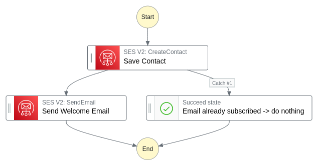

<!-- the preamble is called frontmatter. See docs at https://dev.to/p/editor_guide#front-matter -->

Best article evah! with an image

<!-- seems like SVGs can be uploaded but on dev.to they get transformed into non-svg images -->

